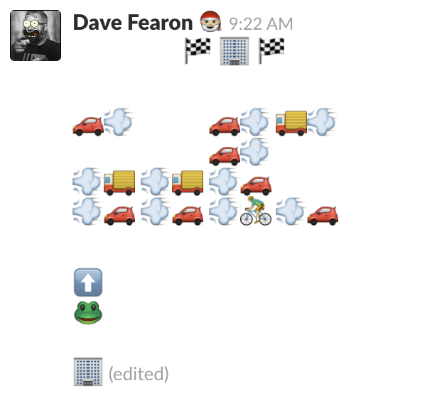

# slack-emoji-painter

Slack React take-home exercise

This is a take-home exercise for engineers at Slack, which is no longer used. I found it in the docs and tackled it as a React exercise. There was some starter code - i.e. the Emoji Picker and Emoji Paint class, but there were also some bugs that needed to be fixed before the app would load properly (those tricksters!).

If this was my app, I would design it a bit differently. I would make the emojis persistently visible, perhaps as a toolbar.

## Slack Documentation

## The Problem

Emoji allow for rich expression in text-based messaging, but laying them out into a scene is difficult in Slack.

We would like to provide users with a way to easily lay out emoji in a grid and then convert that to emoji shortcode for use in Slack.

### What are our goals with this project?

- We would like to increase the number of complex, emoji-only messages in Slack.
- We would like to increase the percentage of messages in Slack that contain at least one emoji.
- We would like to differentiate Slack by providing a tool that is unique and useful.
- We would like to delight users by the ease of creating these scenes and entering them into Slack.

## User focused requirements

**Drawing**

- [√] :star: **P1**: As a user, I should be able to select an emoji from a small subset of Emoji 5.
- [√] :star: **P1**: As a user, I should be able to draw that emoji onto the canvas after selecting the Brush tool.
- [√] **P2**: As a user, while using the Brush tool I should be able to click and hold to enter emoji in all the grid squares that my cursor enters.
- [√] :star: **P1**: As a user, I should be able to erase a painted emoji by clicking on it after selecting the Eraser tool.
- [√] **P2**: As a user, while using the Eraser tool I should be able to click and hold to remove emoji in all the grid squares that my cursor enters.
- [√] **P2**: As a user, I should be able to select a new emoji and overwrite an emoji already in a grid square.

**Grid**

- [√ ] :star: **P1**: As a user, I should be able to adjust the size of the grid by entering numbers into the Height and Width fields.
- [TODO] **P2**: As a user, I should be notified if I enter invalid data into the Height and Width fields (non-numerical data or numbers out of bounds.
- [√ ] **P2**: As a user, I should be able to convert the emoji into shortcodes and have them be stored in my clipboard for later pasting.
- [ √] **P2**: As a user, I should be able to clear the canvas by clicking on the Clear button.

### Demo

https://slack-emoji-painter.netlify.app/
