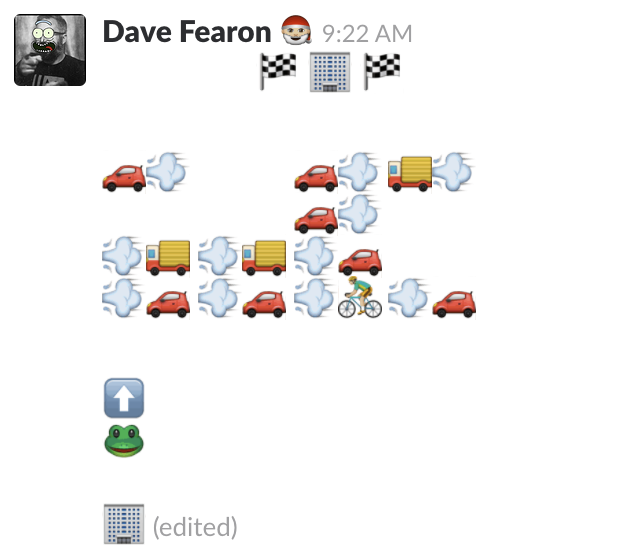

# Exercise instructions :floppy_disk:

:wave: Hello! Thanks so much for participating in our interview process. We know that it takes time and effort away from other things, and we appreciate it.

This exercise is not just a simple test to determine if you can code; we want it to be as close as possible to a task you would complete if you worked at Slack (scaled down so that you can tackle it in roughly three hours or less). The product requirements and designs we provide are of the same style that an engineer here would get, the frameworks and libraries we use are the same, and we review your code in a pull request, just as we do internally. Note that the exercise assumes some familiarity with React. If you've never used React before, we recommend [this tutorial](https://reactjs.org/tutorial/tutorial.html); it should teach you enough to be able to complete the exercise.

This exercise is very important in assessing your technical fit, so make sure you're happy with the result and that it reflects your skills. Your submission should be something you would be proud to submit on the job. Please commit your changes to a new branch in this repo, and once you're happy with the result, create a pull request with a description of your changes. **Please email the URL for the pull request back to us within one week** (but feel free to take the full time).

Your changes will be graded based on adherence to product and design requirements, performance, browser support, code readibility and organization, error handling, lack of defects, and documentation. We'll get back to you within a week of your submission with the outcome. Please note that we will not provide you with detailed feedback on the exercise.

**We've provided some code to get you started, though there are a few bugs in there that you'll have to deal with first.** Let us know if you have any questions. Good luck! :four_leaf_clover:

To run in dev mode:

```
npm start
```

To build for production:

```
npm build
```

# Product requirements :books:

**Note:** These product requirements are created in loosely the same style you would see internally at Slack, but the problem statement and goals were made up for this exercise. As great as emoji art is, we are not actually optimizing for it in our product.

## The Problem

Emoji allow for rich expression in text-based messaging, but laying them out into a scene is difficult in Slack.



We would like to provide users with a way to easily lay out emoji in a grid and then convert that to emoji shortcode for use in Slack.

### What are our goals with this project?

* We would like to increase the number of complex, emoji-only messages in Slack.
* We would like to increase the percentage of messages in Slack that contain at least one emoji.
* We would like to differentiate Slack by providing a tool that is unique and useful.
* We would like to delight users by the ease of creating these scenes and entering them into Slack.

## User focused requirements

**Drawing**
* [x] :star: **P1**: As a user, I should be able to select an emoji from a small subset of Emoji 5.
* [ ] :star: **P1**: As a user, I should be able to draw that emoji onto the canvas after selecting the Brush tool.
* [ ] **P2**: As a user, while using the Brush tool I should be able to click and hold to enter emoji in all the grid squares that my cursor enters.
* [ ] :star: **P1**: As a user, I should be able to erase a painted emoji by clicking on it after selecting the Eraser tool.
* [ ] **P2**: As a user, while using the Eraser tool I should be able to click and hold to remove emoji in all the grid squares that my cursor enters.
* [ ] **P2**: As a user, I should be able to select a new emoji and overwrite an emoji already in a grid square.

**Grid**
* [ ] :star: **P1**: As a user, I should be able to adjust the size of the grid by entering numbers into the Height and Width fields.
* [ ] **P2**: As a user, I should be notified if I enter invalid data into the Height and Width fields (non-numerical data or numbers out of bounds.
* [ ] **P2**: As a user, I should be able to convert the emoji into shortcodes and have them be stored in my clipboard for later pasting (assume the existance of a `:blank:` emoji for the empty cells).
* [ ] **P2**: As a user, I should be able to clear the canvas by clicking on the Clear button.

**User experience**
* [ ] **P2**: As a user, I shouldn't have to wait more than 1500ms for the page to load.
* [ ] **P2**: As a user, the tool should feel responsive to my actions (100ms or less from user action to result on page).
* [ ] **P2**: As a user, I should be able to use all of the features of the emoji layout tool in the latest versions of Chrome and Firefox without experiencing bugs.

## Designs

* [Mock-up in InVision](https://slack.invisionapp.com/share/7MF7465HS#/screens/271908939_Slack_FE_Exercise)

## Open questions

* How many emoji do we want to include?
* Which particular emoji are the most useful in this context?
* Can we make it easy for the user to set up a `:blank:` emoji in their Slack workspace?
* What are useful bounds for the Height and Width fields? How should we message those bounds to the user when they're exceeded?
* Would our technical design change if we wanted to implement a 500x500 grid? What would be the performance concerns of a large grid size?
